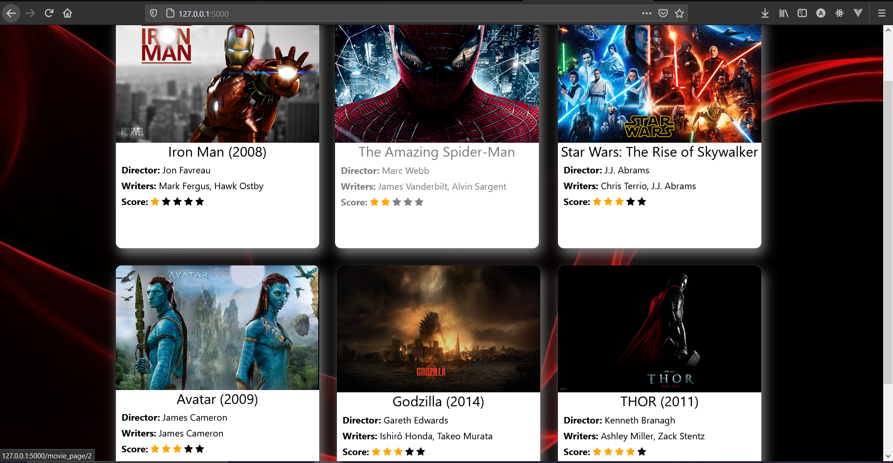
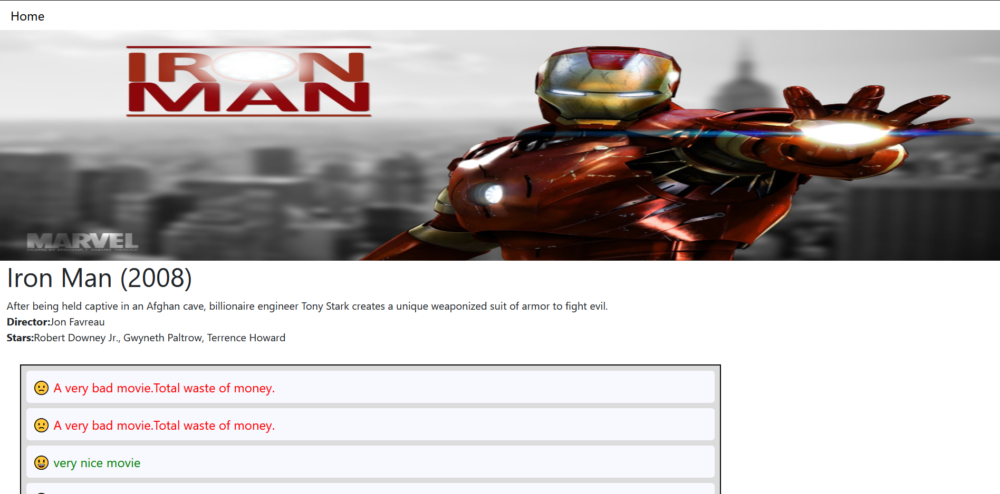
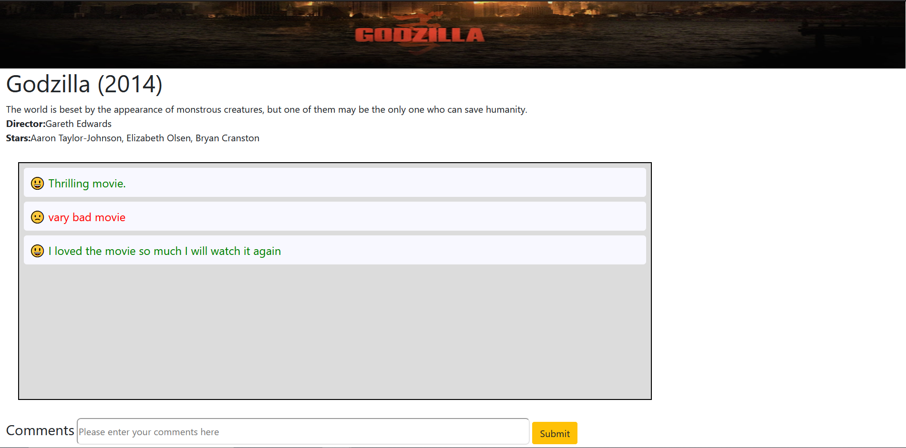

### Serving the tensorflow model using Tensorflow-serving in docker
This will serve model as HTTP/REST API at:localhost:8501
```
docker run -p 8501:8501 --mount type=bind,source=C:\Users\Asus\Desktop\project_practice\model_py,target=/models/my_model  -e MODEL_NAME=my_model -t tensorflow/serving
```

### Create a sqlite3 database and store movies data
In the root folder run the following commands to create database
```
mkdir database
cd database
touch database.db
```

Start python shell in sentiment_analysis folder and run
```
import model
model.create_all()
```

From sentiment_analysis folder run the following command to store movies
```
python movies.py
```

### Start the flask server
The flask server will serve the site at localhost:5000

```
cd sentiment_analysis
python index.py
```
## Demo:
#### The main page consists the rating of each movie,scaled between 1 and 5




#### On this page user can enter reviews.The reviews are sent to the ML model and the review is classified as positive or negative.All the reviews for each movie is stored in the database and also the overall rating of movie is also updated accordingly.
